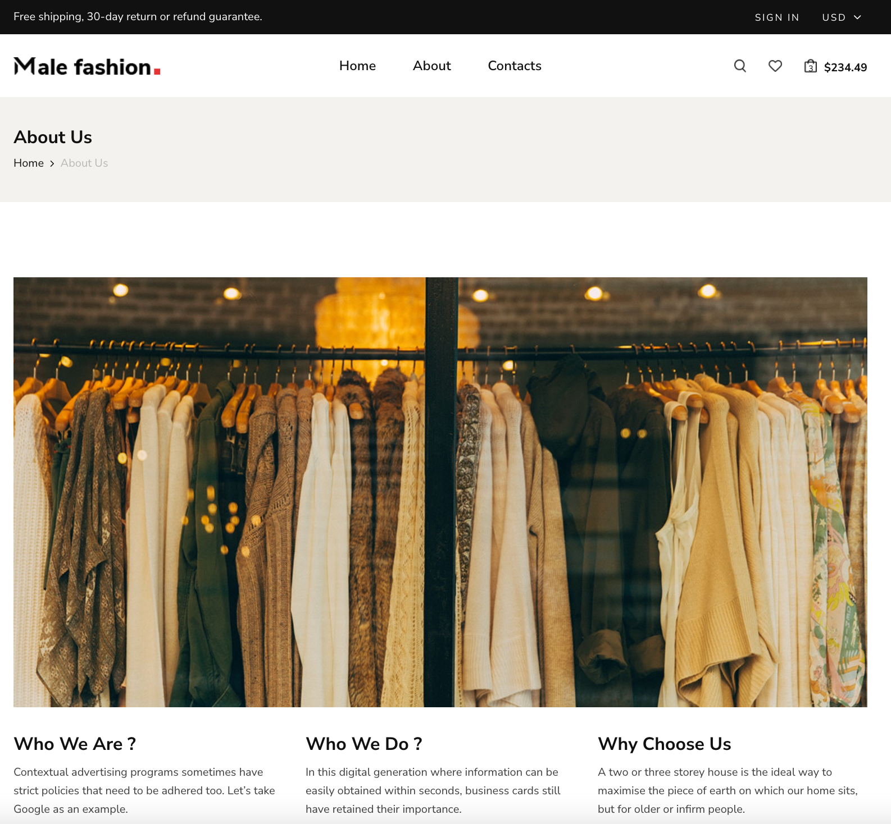
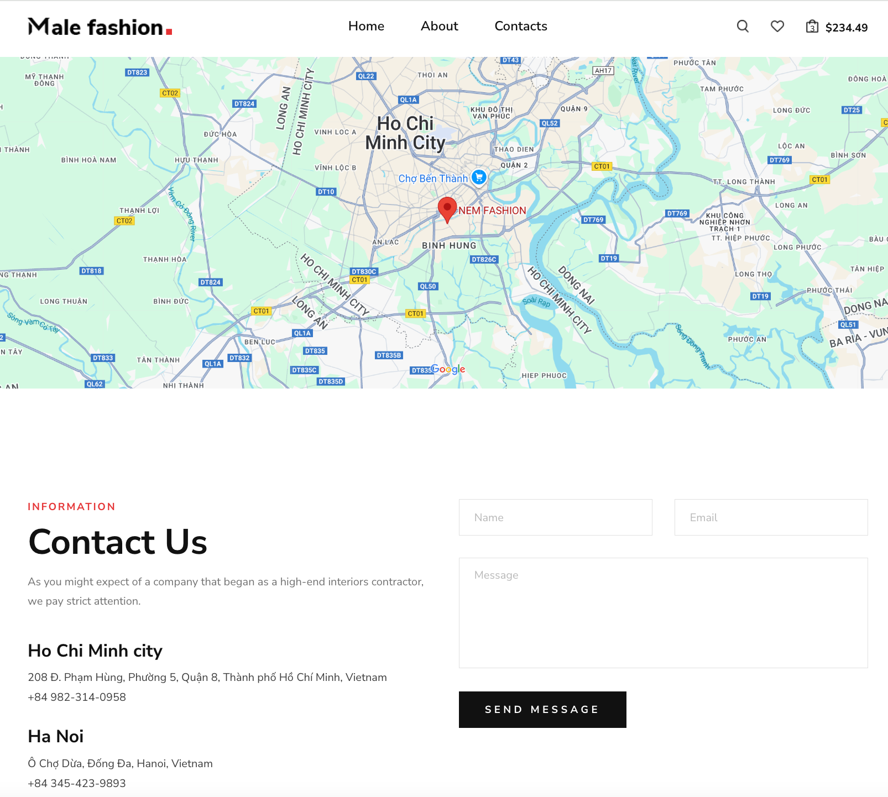
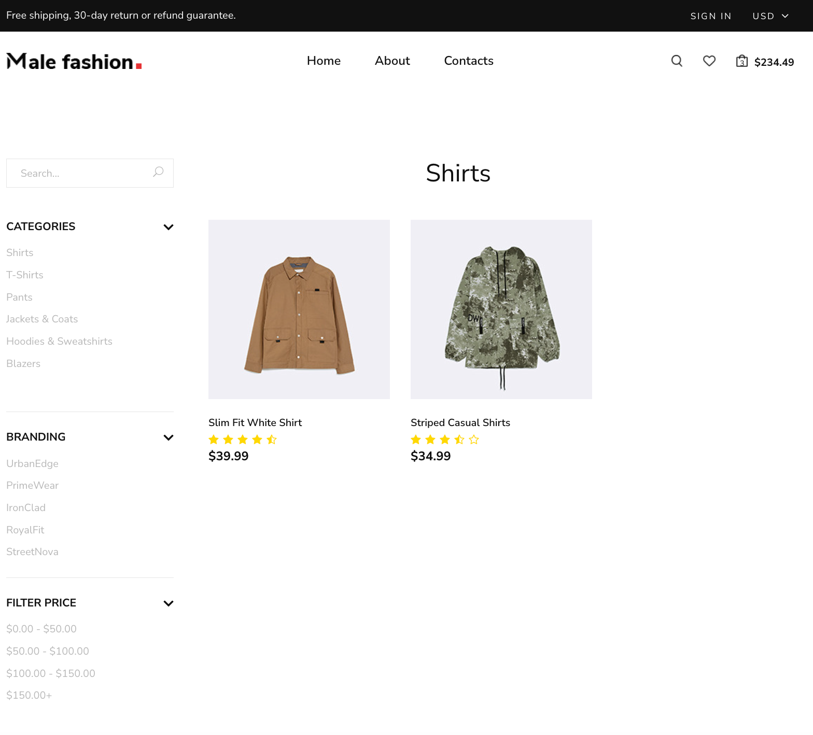
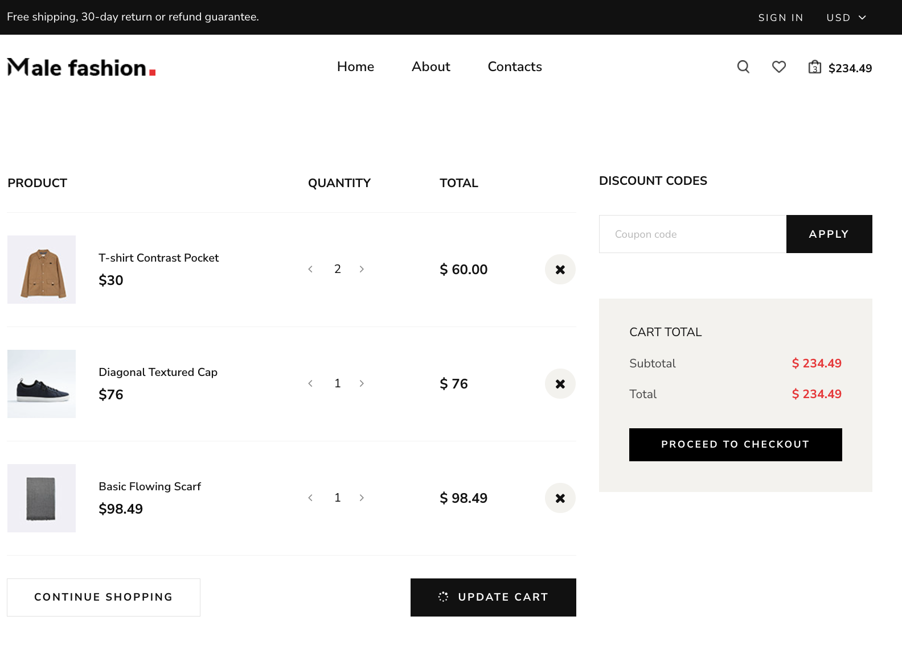
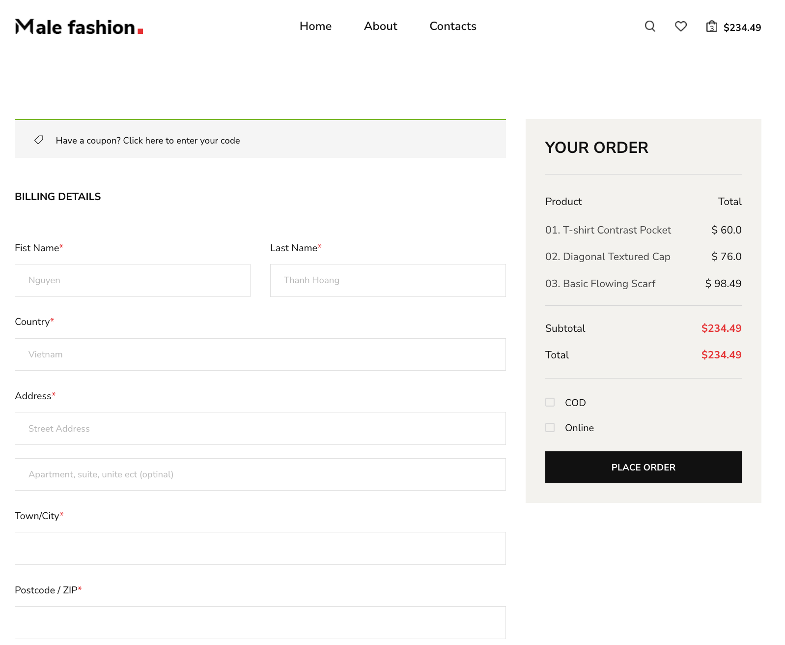
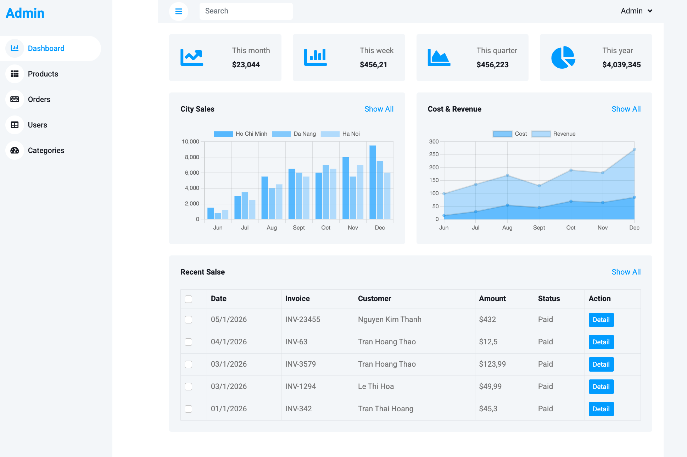
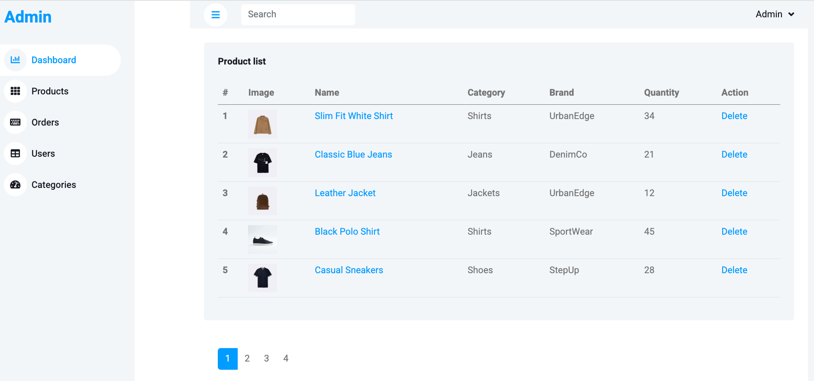
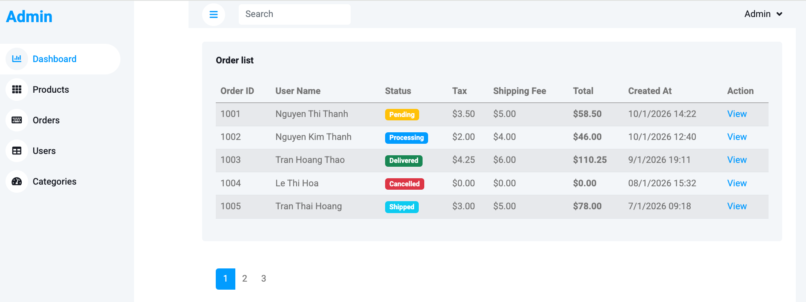
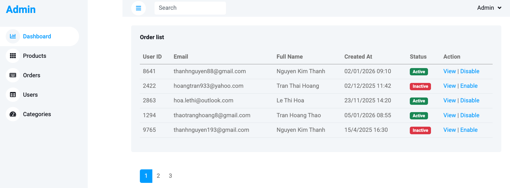
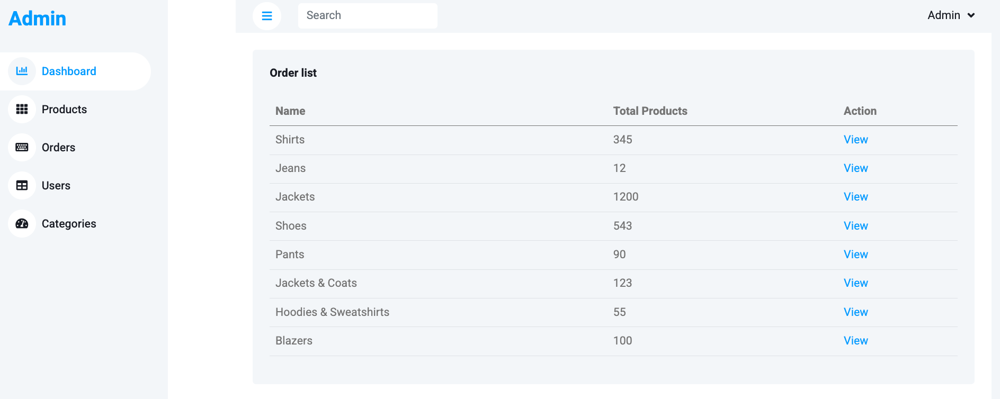

**🛒 C# .NET + SQL Server E-Commerce Management System**\
A full-stack ASP.NET Core MVC web application designed to manage users, products, orders, and sales report with a secure admin dashboard and SQL Server backend.\
This project demonstrates enterprise-level architecture, clean MVC separation, and real-world e-commerce workflows.

**🚀 Screenshots**

  
  
  
  
  
  
  
  

  
  
  
  
  

**📊 Admin Dashboard**\
Total users, products, orders\
Revenue overview

**🧰 Technologies Used**\
ASP.NET Core MVC\
C#	Server-side language\
SQL Server	Relational database\
Entity Framework Core	ORM\
Bootstrap 5	UI styling\
HTML/CSS/JS	Frontend\
Visual Studio Code IDE

**📦 Project Structure**\
/Controllers\
/Models\
/Views\
/Data\
/wwwroot\
/appsettings.json

**⚙️ Setup Instructions**\
1️⃣ Clone Repository\
2️⃣ Configure SQL Server\
Create a new database in SQL Server:\
CREATE DATABASE malefashion;\
Open appsettings.json and update:\
"ConnectionStrings": {\
  "MyDatabase": "Server=.;Database=malefashion;User Id=xxx;Password=xxxx;Trusted_Connection=True;TrustServerCertificate=True"\
}

**3️⃣ Run Sample SQL to create tables and data**\
1. /Data/create_tables.sql
2. /Data/insert_data.sql

**4️⃣ Run the Application**\
dotnet run

**🧑‍💻 Author**\
Sang Do\
IT Lecturer
